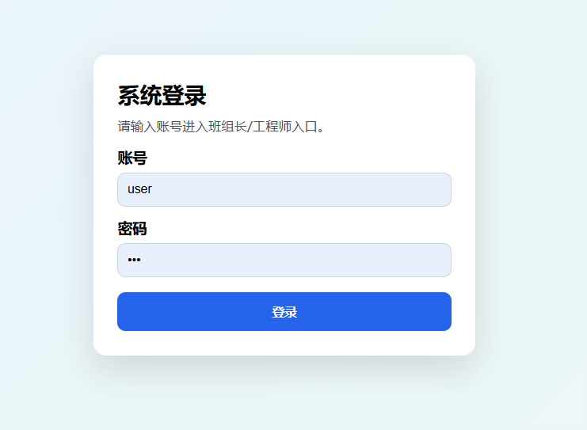
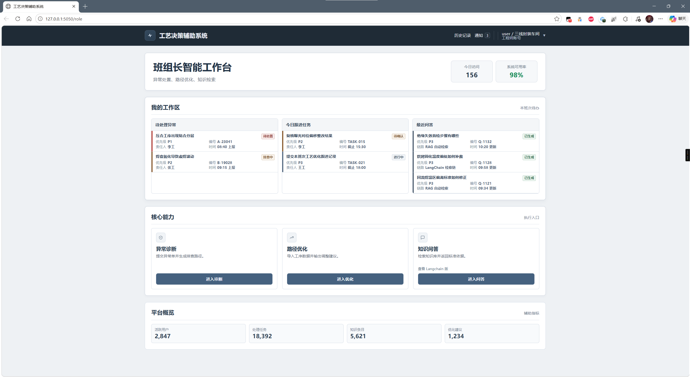
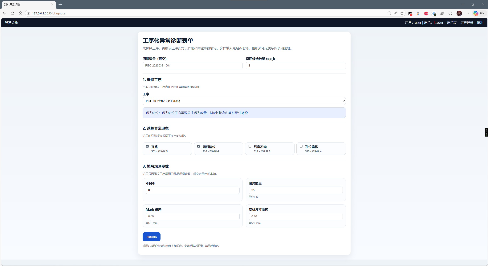
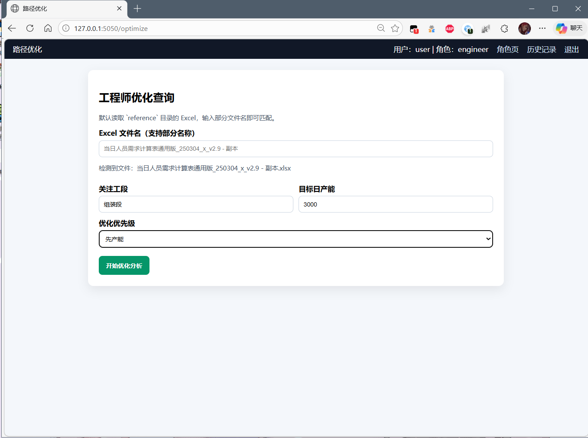
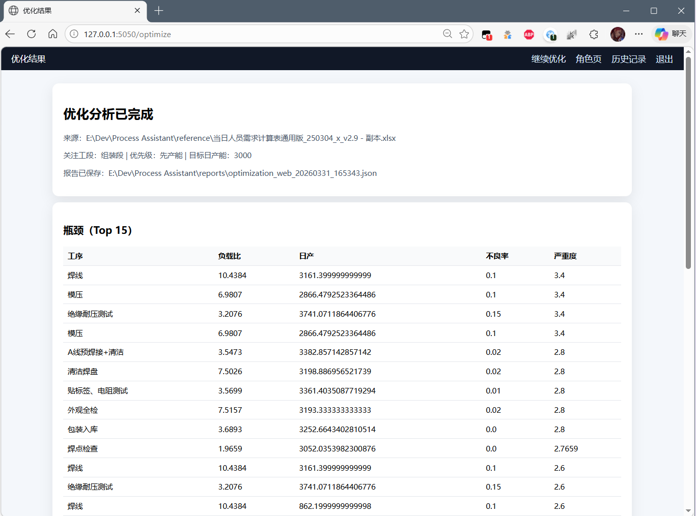
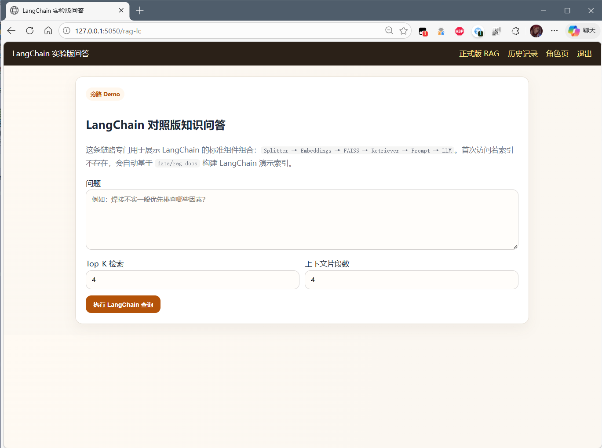
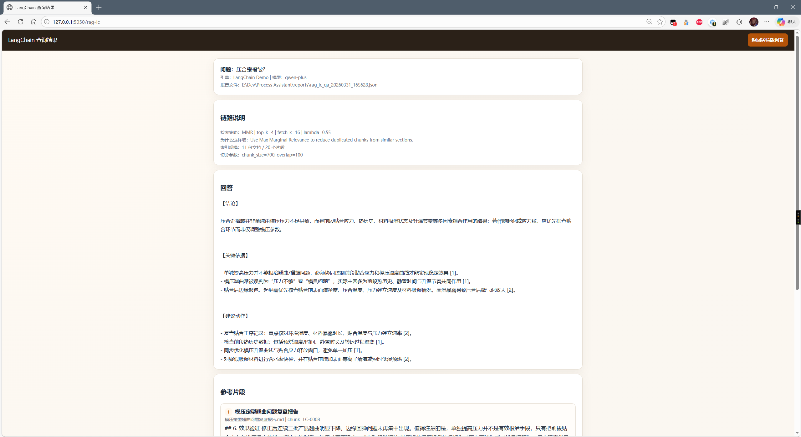
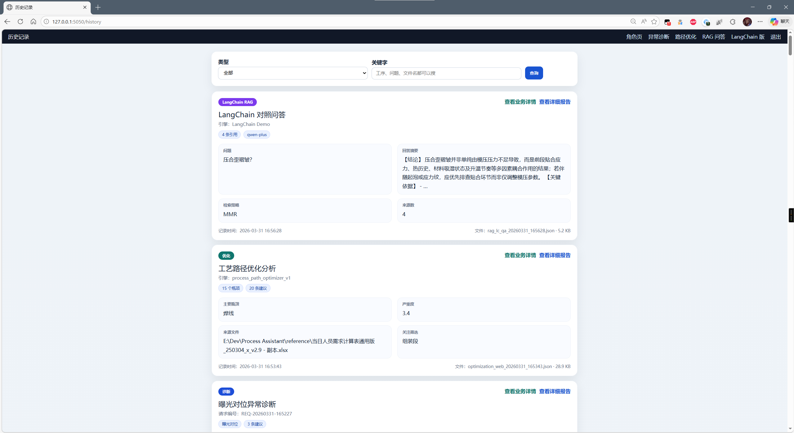

# 工艺决策辅助系统

这是一个面向 PCB / FPCB 工艺场景的本地化演示项目。它不是那种什么都想包进去的大系统，而是把几个最有代表性的能力先做成一套能跑、能看、能讲清楚的成品：班组长可以做异常诊断，工程师可以看路径优化，系统里还放进了两条可运行的工艺问答链路，一条是项目自己实现的 RAG，另一条是单独补上的 LangChain 对照版。

整个项目的出发点很简单：很多工艺系统要么只会记表单，要么只会堆大模型，但真正落到现场时，大家更关心的是“我现在这个异常先看什么”“为什么系统这么判断”“这个建议能不能追溯”。所以这个仓库里保留了两条思路并行存在：一条是结构化决策链，强调规则、案例和可解释；另一条是文档问答链，强调知识检索、来源引用和演示效果。

## 这个项目现在能做什么

如果把它当成一个完整的小系统来看，它现在已经有比较清楚的三条主线。第一条是异常诊断，面向班组长或现场负责人，先选工序，再选异常现象，再填这个工序真正相关的观测参数，最后给出可能原因、建议动作和追溯依据。第二条是路径优化，面向工艺工程师，读取 Excel 里的工时和产能信息，帮助识别瓶颈工序，并给出可以继续分析的优化建议。第三条是工艺知识问答，既有正式版 RAG，也有 LangChain 对照版，方便做功能演示和技术说明。



系统从登录页进入，默认账号是 `user`，密码是 `123`。这部分做得很轻，目的主要是让演示流程完整一些，不至于一打开就是裸页面。



登录后会先来到角色页。这里把系统能力拆成了三个入口：班组长入口负责异常诊断，工程师入口负责路径优化，右边是工艺问答入口。正式版 RAG 和 LangChain 实验版在这里就是分开的，这样使用时不会混淆，也方便后面解释两条链路各自的定位。

## 异常诊断是怎么设计的

异常诊断这部分没有直接让 RAG 接管，而是继续走结构化决策链。这样做的原因是，在现场排查这类问题里，可控和可解释通常比“像聊天”更重要。系统内部有一套样本知识库，里面放了 PCB / FPCB 常见工序下的异常、原因、规则和案例；前端表单也不是一个所有工序共用的大杂烩，而是先按工序切换，再显示这个工序真正需要填写的参数。


比如曝光对位工序，系统会引导用户优先关注曝光能量、Mark 偏差和基材尺寸漂移，而不会把焊接阶段才会出现的助焊剂类参数强行摆在面前。这样一来，页面会更像工艺系统，后端收到的数据也更干净。



这套诊断链路的核心想法不是“猜答案”，而是把几种证据放到一起做排序：规则匹配、案例相似、原因画像，以及历史反馈对有效率的修正。它的好处是你可以比较自然地讲清楚系统为什么给出某条建议，而不是只能说“模型觉得像”。

## 路径优化做的是什么事

路径优化这部分更像一个给工艺工程师用的小工具。它会读取 `reference` 目录下的 Excel 数据，结合工序节拍、负载比、良率和目标产能去找瓶颈。它不是在替代完整的工业工程系统，而是把“快速识别问题工段并形成初步建议”这一步做出来。



输入方式保持得比较简单，因为这个模块想体现的是分析逻辑，而不是复杂的数据接入界面。你输入文件名、关注工段、目标日产能之后，系统会给出一份结果报告。



结果里会展示瓶颈工序、负载比、日产能、不良率和严重度等信息。这个页面不是做成炫技风格，而是尽量像一份工程分析结果，方便继续讨论“到底是哪一段卡住了”。

## 工艺问答为什么做成两条链

这个项目里的问答模块是一个很重要的亮点。正式版 RAG 是项目自己搭的，链路里包含了文档接入、切分、向量化、检索、查询归一化、轻量重排、证据门控、回答生成和来源引用。这样做的好处是结构清楚，可解释性也强，适合当成主线版本来展示。

LangChain 版则是专门做出来的对照版。它不替换主干，只是单独保留一条使用 LangChain 标准组件的实现，帮助理解 `Splitter -> Embeddings -> FAISS -> Retriever -> Prompt -> LLM` 这条常见链路在工程里到底长什么样。这样一来，项目既能体现“自己把 RAG 做通了”，也能体现“知道怎么用框架快速搭建一条演示链”。



LangChain 这一页的目标不是把所有自定义优化再抄一遍，而是把框架组件的组合方式展示得清清楚楚。所以它会更轻一些，但也保留了来源片段和检索说明，方便对照理解。



正式版 RAG 和 LangChain 版都能做工艺问答，不过角色不一样。前者更适合做正式演示和后续扩展，后者更适合展示框架能力和帮助理解技术结构。

## 历史记录现在怎么看

历史页也做过一轮专门优化。最早的版本更像开发时的报告列表，适合查 JSON，不太适合普通使用者。现在它先展示业务卡片，把时间、类型、主题、关键结论和摘要先放在第一层，只有你真的想看原始报告时，再点进去看技术详情。



这样分成“卡片摘要”和“技术详细报告”两层后，系统既保留了调试和回溯能力，也不会让用户一上来就看到一整屏 JSON。

## 代码结构该从哪里看起

如果你是第一次看这个仓库，我建议先从 `web_ui.py` 和 `process_assistant/cli.py` 开始，因为它们分别对应网页入口和命令行入口，最容易看出系统是怎么被串起来的。接着可以看 `process_assistant/diagnosis_engine.py` 和 `process_assistant/optimization_engine.py`，这两部分对应结构化诊断和路径优化的核心逻辑。等你对主流程熟悉了，再去看 `process_assistant/rag_pipeline.py`、`process_assistant/vector_index.py` 和 `process_assistant/langchain_demo.py`，会更容易把两条问答链路的差异看明白。

仓库里现在几个最关键的目录分别承担不同角色。`data` 放样本知识、RAG 语料和运行后生成的索引；`examples` 放命令行示例输入；`process_assistant` 放核心 Python 模块；`templates` 放 Web 页面；`docs` 放设计说明和语料说明。整体上故意没有拆得特别散，因为这个项目的重点不是做一套过度工程化的框架，而是把关键能力讲清楚、跑通并保留下来。

## 本地运行并不复杂

如果你只是想把系统跑起来，先安装依赖，然后准备好 `.env` 文件，再启动 Web 服务就可以了。RAG 相关功能默认按阿里兼容 OpenAI 的接口读取配置，所以如果你想用问答能力，需要在 `.env` 里配好 `PROCESS_ASSISTANT_API_KEY`、`PROCESS_ASSISTANT_BASE_URL`、`PROCESS_ASSISTANT_CHAT_MODEL` 和 `PROCESS_ASSISTANT_EMBED_MODEL`。如果你暂时只看结构化诊断和优化模块，不配这部分也没关系。

```bash
pip install -r requirements.txt
python web_ui.py
```

启动后直接访问 `http://127.0.0.1:5050` 就可以了。

如果你更喜欢先从命令行看，也可以直接用 CLI。这个项目保留了几条比较直观的命令，比如异常诊断、反馈写入、RAG 建索引、自研版问答和 LangChain 问答。命令参数已经尽量做得平实，配合 `examples` 目录就能跑通。

```bash
python -m process_assistant.cli diagnose --input examples/diagnosis_request.json
python -m process_assistant.cli feedback --input examples/feedback_event.json
python -m process_assistant.cli rag-build --docs-dir data/rag_docs --index-dir data/rag_index
python -m process_assistant.cli rag-ask --index-dir data/rag_index --question "焊线后虚焊先看什么？"
python -m process_assistant.cli rag-build-lc --docs-dir data/rag_docs --index-dir data/rag_index_langchain
python -m process_assistant.cli rag-ask-lc --index-dir data/rag_index_langchain --question "压合歪斜一般先看哪些因素？"
```

## 最后补一句项目定位

这个仓库不是为了证明“所有问题都能靠大模型解决”，也不是为了做一个看起来很复杂但很难落地的系统。它更像是一个把几条常见工艺辅助能力认真做成样子的项目：结构化诊断负责把现场判断说清楚，路径优化负责把瓶颈看出来，RAG 负责把文档知识接进来，而 LangChain 对照版则负责把技术路径讲明白。

如果你是把它当作品集来看，我觉得它的价值不只是“做了什么功能”，更在于这些功能之间的边界是清楚的，很多地方也刻意保留了可解释性。后面无论你想继续补知识库、继续打磨前端，还是把某条链路真正往生产方向推进，这个底子都还是比较顺手的。
